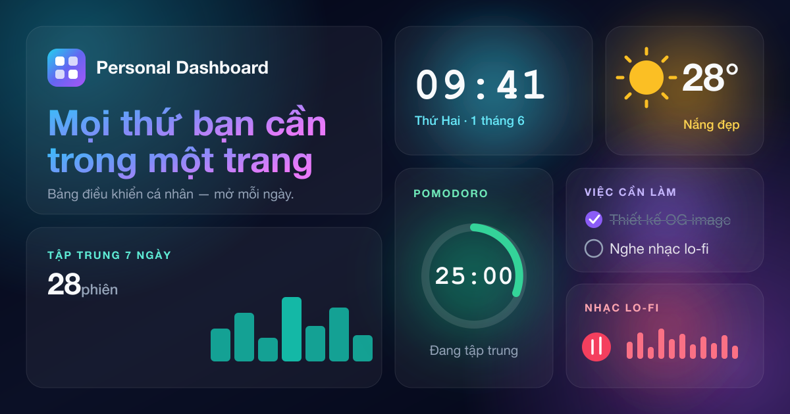

# Personal Dashboard

Bảng điều khiển cá nhân all-in-one — mở mỗi ngày. Đồng hồ, thời tiết & dự báo,
lịch âm dương, to-do, Pomodoro, thói quen, ghi chú, bookmark, thống kê và nhạc
lo-fi. Tuỳ biến theme, đa ngôn ngữ (VI/EN), cài như PWA và đồng bộ đám mây.



## ✨ Tính năng

- **10 widget** kéo-thả sắp xếp + ẩn/hiện: Clock, Weather, To-do, Pomodoro,
  Calendar (âm + dương lịch), Lo-fi, Notes, Habits, Bookmarks, Stats
- **Lo-fi player**: radio (SomaFM) + playlist YouTube (tua/loop/shuffle) +
  bộ trộn âm thanh nền (mưa/sóng/lửa/gió bằng Web Audio)
- **Nền động theo thời tiết**: nắng/đêm sao/âm u/mưa/tuyết
- **8 theme + custom theme builder**, sáng/tối
- **Command palette** (⌘K), **Focus mode**, pháo hoa khi hoàn thành todo
- **i18n** Tiếng Việt / English
- **PWA** cài được + chạy offline
- **Đăng nhập Google + đồng bộ realtime đa thiết bị** (Supabase)

## 🛠 Tech stack

Vite · React 19 · TypeScript · Tailwind CSS v4 · Zustand · @dnd-kit ·
Supabase (Auth + Postgres + Realtime) · vite-plugin-pwa

## 🚀 Chạy local

```bash
npm install
cp .env.example .env.local   # điền key Supabase
npm run dev
```

### Supabase (tuỳ chọn — cho đăng nhập & đồng bộ)

1. Tạo project tại [supabase.com](https://supabase.com), lấy Project URL + anon key → `.env.local`
2. Bật Google provider (Authentication → Providers) + thêm redirect URL `http://localhost:5173`
3. Áp migration: `supabase link --project-ref <ref>` rồi `supabase db push`
   (hoặc chạy `supabase/migrations/*.sql` trong SQL Editor)

Không cấu hình Supabase thì app vẫn chạy ở **chế độ khách** (lưu localStorage).

## 📦 Build

```bash
npm run build
npm run preview
```
